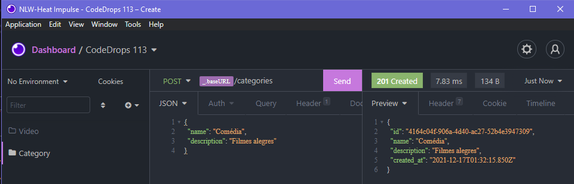
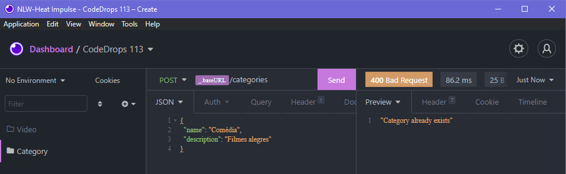
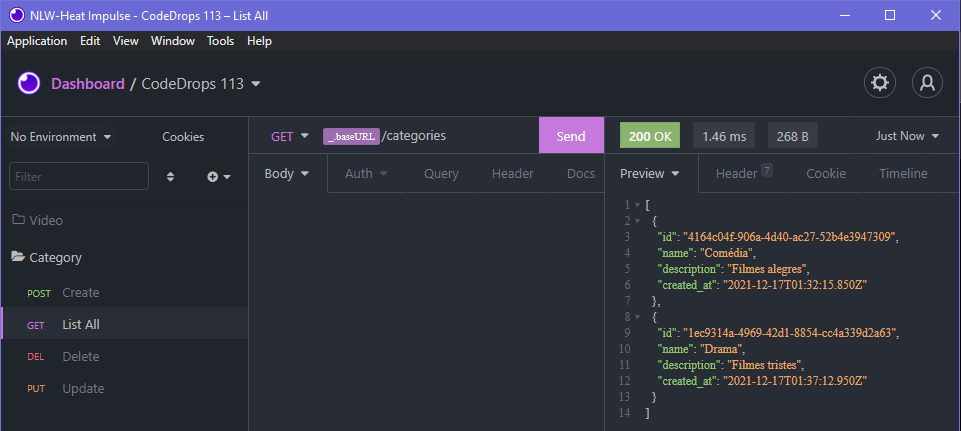
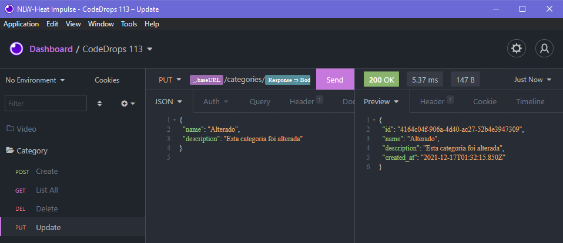
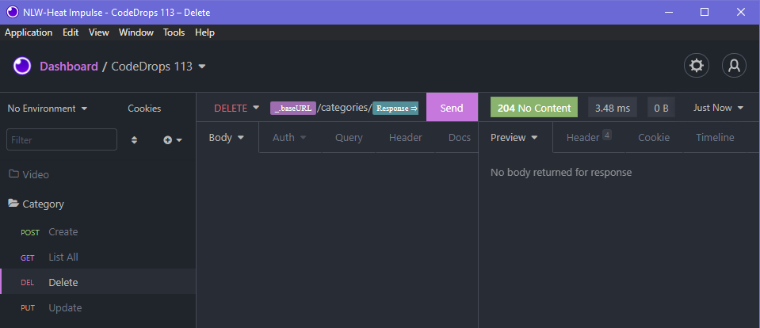
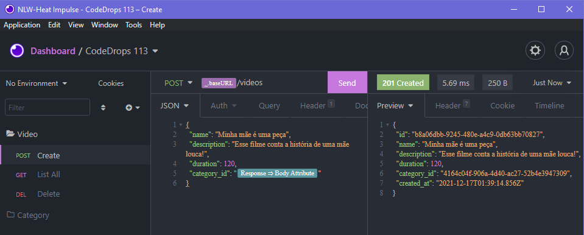
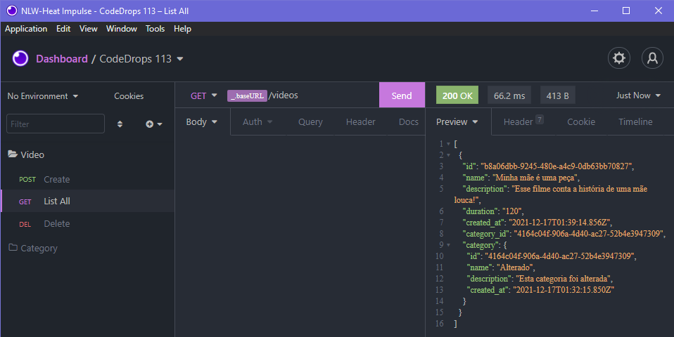
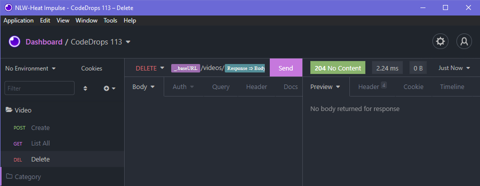
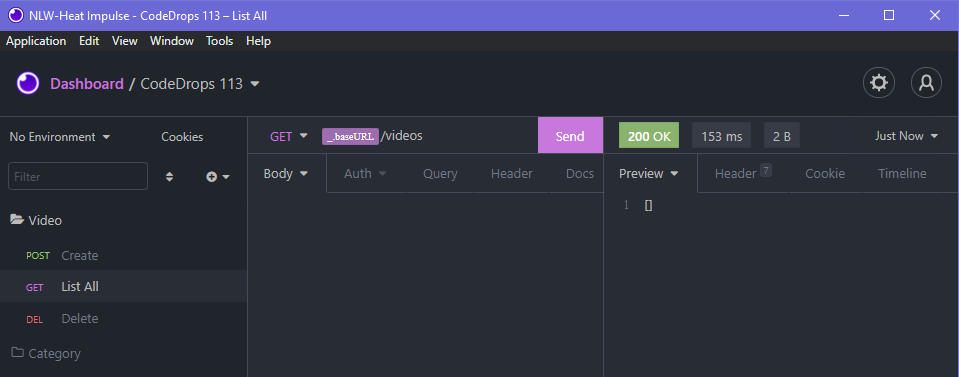

# :rocket::seat: Code/drops #113 - Node Backend - Express, TypeORM and PostgreSQL :outbox_tray:

A simple Node/Express backend using TypeORM and PostgreSQL. Project based on [CRUD com Node.JS, Express, TypeORM e PostgreSQL - CodeDrops #113](https://www.youtube.com/watch?v=9AO2hZJsHrs).

## :hammer: Status

> :white_check_mark: Finished :lock:

## :bookmark: Content Table
<!--ts-->
  * [Results](#newspaper-results)
  * [Technologies](#books-technologies)
  * [Install and Run](#calling-installing-and-running-this-project)
  * [Author and License](#memo-author-and-license)
<!--te-->

## :newspaper: Results

<details>
  <summary>Creating a category</summary>
  <p align="center"></p>
</details>
<details>
  <summary>Error case: repeated category</summary>
  <p align="center"></p>
</details>
<details>
  <summary>Listing all available categories</summary>
  <p align="center"></p>
</details>
<details>
  <summary>Updating a category</summary>
  <p align="center"></p>
</details>
<details>
  <summary>Deleting a category</summary>
  <p align="center"></p>
</details>
<details>
  <summary>Creating a video</summary>
  <p align="center"></p>
</details>
<details>
  <summary>Listing all available videos</summary>
  <p align="center"></p>
</details>
<details>
  <summary>Deleting a category</summary>
  <p align="center"></p>
</details>
<details>
  <summary>Listing remaining videos (empty)</summary>
  <p align="center"></p>
</details>

## :books: Technologies

- [NodeJS](https://nodejs.org/en/)
- [Yarn](https://yarnpkg.com/)
- [Typescript](https://www.typescriptlang.org/)
- [Express](https://expressjs.com/)
- [TypeORM](https://typeorm.io/)
- [PostgreSQL](https://www.postgresql.org/)
- [Insomnia.REST](https://insomnia.rest/)

## :calling: Installing and running this project

### :wrench: Prerequisites

Before starting, make sure you have [Git](https://git-scm.com/), [Node](https://nodejs.org/en/) and [Yarn](https://yarnpkg.com/) installed. It's also recommended to have [Insomnia](https://insomnia.rest/) installed in order to perform manual tests in the final step of these instructions.

This project is intended for use with a [PostgreSQL](https://www.postgresql.org/) database. Make sure to create a `.env` file with your credentials following the pattern in `.env.example` in order to configure the connection to your local database.

### :inbox_tray: Installation

Clone the project using Git and install its dependencies through Yarn:

```bash
git clone https://github.com/jobsonita/rocketseat-yt-cd-113-node-backend.git

# wait for git to finish clonning the project, then navigate to the folder and install the dependencies:

cd rocketseat-yt-cd-113-node-backend

yarn
```

After this is done, create a copy of the file `.env.example` (or just rename it) as `.env` and fill it properly.

Finally, run the migrations:

```bash
yarn typeorm migration:run
```

### :traffic_light: Execution

With the project installed and configured, run:

```bash
yarn dev
```

### :mag: Testing

Open Insomnia, import the [Insomnia requests file](tools/Insomnia_Requests.json) and execute the available requests. Use your preferred database administration tool to check your database. If everything is configured correctly, you should see the data being modified according to your requests.

## :memo: Author and License

[](https://github.com/jobsonita/jobsonita) | [Jobson Gilberto](https://github.com/jobsonita/jobsonita)
-|-

[](LICENSE)
